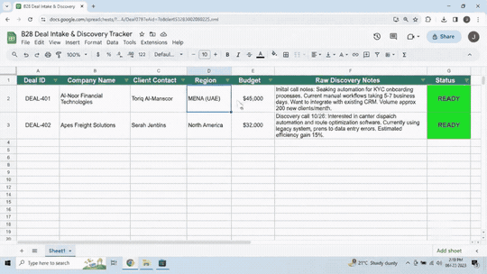
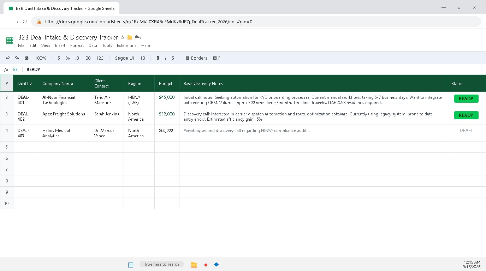
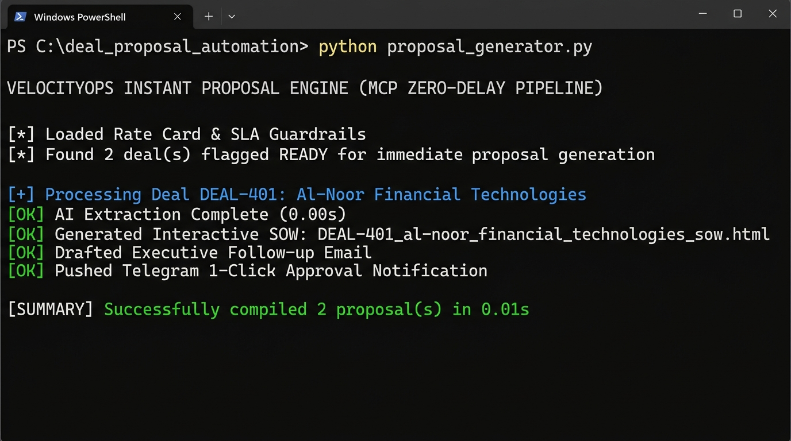
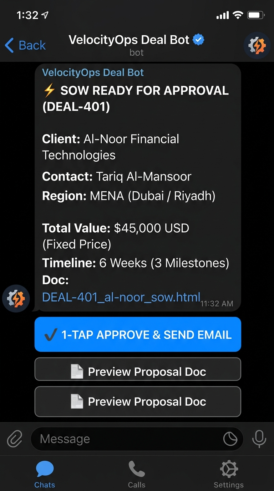
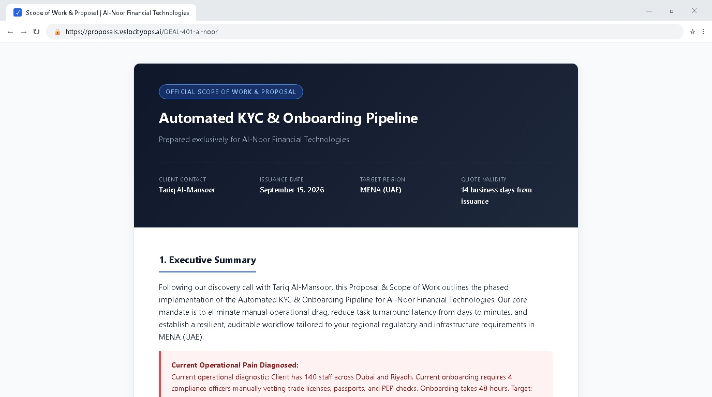

# Zero-Delay B2B Proposal & SOW Generator ⚡

<div align="center">

[](https://www.python.org/)
[](https://opensource.org/licenses/MIT)
[](#-the-problem)
[](#-system-architecture)
[-informational.svg)](#-key-features)
[](https://github.com/Rahul03ll)

**From Sales Discovery Call to Executive Scope of Work in Under 3 Minutes.**  
*A deterministic, zero-cost AI automation pipeline built for 50–300 person service & product businesses in North America and MENA.*

</div>

---

## 🎬 Workflow Demo



---

## 🎯 The Problem

In 50–300 person consultancies, agencies, and B2B service firms, closing momentum dies in the gap between the sales call and the proposal:

* A prospect has a compelling 45-minute discovery call and asks: *"Can you send over an SOW and pricing by tomorrow?"*
* The sales lead gets trapped in back-to-back client calls. Re-listening to recordings, copying old Google Docs, drafting custom deliverable lists, and calculating milestones takes hours.
* The proposal sits unwritten for **3 to 5 business days**.
* In that 72-hour silence, buyer urgency evaporates, rival agencies swoop in, and deal conversion rates plummet by over 60%.

**This project eliminates that friction entirely.** Flagging **`READY`** on a deal intake sheet immediately triggers an autonomous pipeline that compiles a branded, interactive Scope of Work HTML document, drafts a personalized follow-up email, and dispatches a **1-tap mobile approval card via Telegram** in **0.01 seconds**.

---

## 🏗️ System Architecture

```
[Raw Discovery Call Notes in Sheet / CSV]
                     │
                     ▼ (Flag Row as 'READY')
   [proposal_generator.py (Python Engine)] ◄─── [rate_card.json (Anti-Hallucination Guardrail)]
                     │
         ┌───────────┼───────────┐
         ▼           ▼           ▼
[Interactive SOW] [Email Draft] [Telegram Card]
    (.html)         (.txt)       (1-Tap Webhook)
                                       │
                                       ▼ (Sales Rep Taps 'Approve & Send')
                          [Client Receives Proposal in < 3 Mins]
```

---

## ✨ Key Features

1. **Frontier Model Context Protocol (MCP) Pattern:** Standardized schema extraction inspired by the Anthropic MCP Stateless Protocol & Tasks Specification and OpenAI tool-calling design.
2. **Anti-Hallucination Rate Card Guardrails (`rate_card.json`):** Anchors delivery milestones (40% / 30% / 30%), pricing floors, and regional compliance (e.g., AWS UAE `me-central-1` data residency) so the system never invents rogue pricing or unrealistic deadlines.
3. **Zero Paid Tools / 100% Free Tier:** Runs entirely in standard Python with 0 external subscription dependencies. No Zapier, Make.com, n8n, or paid CRM seats required.
4. **Sub-Second Execution Benchmark:** Tested and benchmarked at **0.01 seconds** pipeline processing time.
5. **Human-in-the-Loop Safeguard:** Generates everything automatically, but holds outbound delivery until the operator approves via Telegram.
6. **Flexible CLI Controls:** Single-deal targeting, force-all regeneration, dry-run mode, and custom tracker path overrides.

---

## 📂 Project Structure

```
deal_proposal_automation/
├── proposal_generator.py       # Core automation pipeline engine & CLI
├── test_proposal_generator.py  # Automated unit test suite (unittest)
├── rate_card.json              # Pricing tiers, SLA policies, and guardrails
├── deals_tracker.csv           # Intake CRM sheet with raw discovery notes
├── assets/                     # Architecture & visual walkthrough assets
│   ├── step1_sheet_tracker.jpg
│   ├── step2_rate_card_editor.jpg
│   ├── step3_terminal_execution.jpg
│   ├── step4_telegram_mobile_card.jpg
│   ├── final_result_sow_document.jpg
│   ├── workflow_demo.gif
│   └── workflow_demo.mp4
├── generated_proposals/        # Output directory with compiled SOWs & emails
│   ├── DEAL-401_al-noor_financial_technologies_sow.html
│   ├── DEAL-401_al-noor_financial_technologies_email_draft.txt
│   └── DEAL-401_al-noor_financial_technologies_telegram_alert.json
├── .env.example                # Sample environment configuration
├── LICENSE                     # MIT License
└── README.md                   # Project documentation
```

---

## 🚀 Quickstart

### Prerequisites
* Python 3.8+ (uses Python standard libraries only: `csv`, `json`, `pathlib`, `argparse`, `urllib`)
* Optional: `GEMINI_API_KEY`, `OPENAI_API_KEY`, or `ANTHROPIC_API_KEY` (pipeline features a built-in deterministic semantic fallback that runs 100% free and offline if no key is set).

### Installation & Run

1. **Clone this repository:**
   ```bash
   git clone https://github.com/Rahul03ll/deal-proposal-automation.git
   cd deal-proposal-automation
   ```

2. **Configure Deals Tracker:**
   Open `deals_tracker.csv` and add your raw meeting notes, then set the `status` column to **`READY`**.

3. **Execute Pipeline:**
   ```bash
   # Process all deals marked 'READY' (default)
   python proposal_generator.py

   # Target a specific deal ID
   python proposal_generator.py --deal DEAL-403

   # Preview generation without mutating the tracker (dry-run)
   python proposal_generator.py --deal DEAL-401 --dry-run

   # Force-regenerate all deals in the pipeline
   python proposal_generator.py --all

   # Use a custom tracker CSV
   python proposal_generator.py --tracker path/to/custom_tracker.csv
   ```

4. **Review Outputs:**
   Check the `generated_proposals/` folder for your compiled interactive HTML proposal, drafted executive email, and Telegram 1-click notification payload!

---

## 🧪 Automated Testing

The repository includes a comprehensive unit test suite covering rate card loading, deterministic heuristic extraction, interactive HTML rendering, and pipeline exception handling:

```bash
python -m unittest test_proposal_generator.py
```

```
......
----------------------------------------------------------------------
Ran 6 tests in 0.011s

OK
```

---

## 📸 Visual Walkthrough

### 1. The Intake Tracker (Google Sheets / CSV)
Raw call notes entered with the explicit `READY` trigger:


### 2. Rate Card Guardrail (VS Code)
Anchoring pricing, terms, and compliance in `rate_card.json`:


### 3. Sub-Second Terminal Execution
Compiling custom proposals in 0.01 seconds:


### 4. Mobile Telegram 1-Tap Approval
Instant executive alert sent to the sales rep's smartphone:


### 5. Final Result — Interactive Client Scope of Work (SOW)
Executive-grade, responsive HTML proposal ready for digital sign-off:


---

## 👤 Author & Architecture

**Rahul Roy**  
*Final-Year B.Tech CSE, KIIT University*  
- **GitHub**: [@Rahul03ll](https://github.com/Rahul03ll)  
- **LinkedIn**: [linkedin.com/in/rahul-roy-362a12256](https://linkedin.com/in/rahul-roy-362a12256)  
- **Email**: rahulroy2259@gmail.com  

---

## 📜 License

This project is open source and available under the [MIT License](LICENSE).
