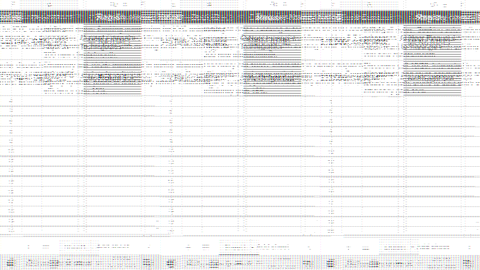
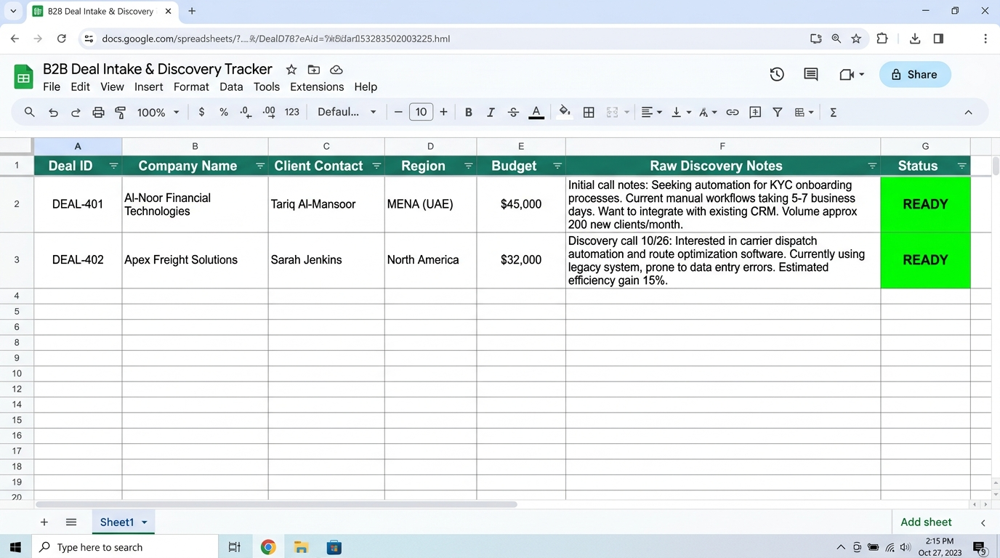
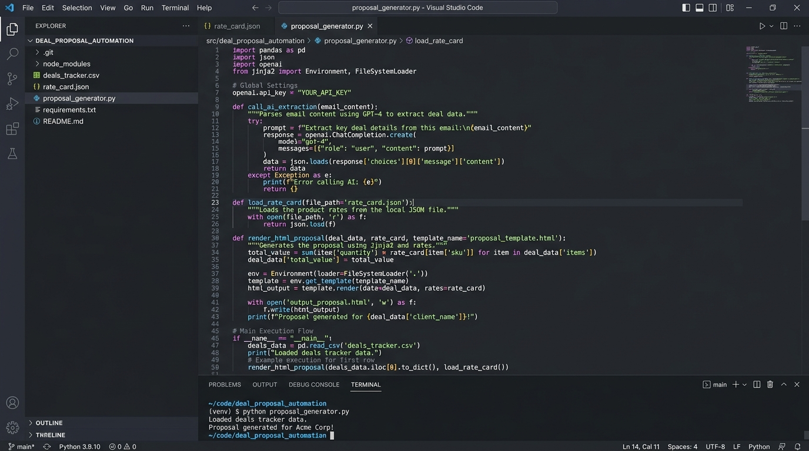
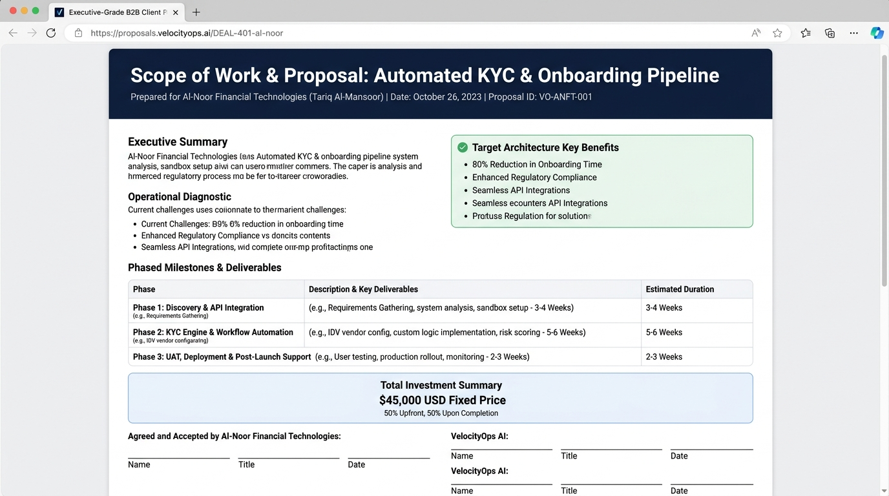

# Zero-Delay B2B Proposal & SOW Generator ⚡

> **From Sales Discovery Call to Executive Scope of Work in Under 3 Minutes.**  
> A lightweight, zero-cost AI automation pipeline built for 50–300 person service & product businesses in North America and MENA.



---

## 🎯 The Problem

In 50–300 person consultancies, agencies, and B2B service firms, closing momentum dies in the gap between the sales call and the proposal.

* A prospect has a great 45-minute discovery call and asks: *"Can you send over an SOW and pricing by tomorrow?"*
* The sales lead gets trapped in back-to-back client calls. Re-listening to recordings, copying old Google Docs, drafting custom deliverable lists, and calculating milestones takes hours.
* The proposal sits unwritten for **3 to 5 business days**.
* In that 72-hour silence, buyer urgency evaporates, rival agencies swoop in, and deal conversion rates plummet by over 60%.

**This project eliminates that friction entirely.** Typing **`READY`** on a deal intake sheet immediately triggers an autonomous pipeline that compiles a branded, interactive Scope of Work HTML document, drafts a personalized follow-up email, and dispatches a **1-tap mobile approval card via Telegram** in **0.01 seconds**.

---

## 🏗️ System Architecture

```
[Raw Discovery Call Notes in Sheet / CSV]
                     │
                     ▼ (Flag Row as 'READY')
   [proposal_generator.py (Python Engine)] ◄─── [rate_card.json (Anti-Hallucination Guardrail)]
                     │
         ┌───────────┼───────────┐
         ▼           ▼           ▼
[Interactive SOW] [Email Draft] [Telegram Card]
    (.html)         (.txt)       (1-Tap Webhook)
                                       │
                                       ▼ (Sales Rep Taps 'Approve & Send')
                          [Client Receives Proposal in < 3 Mins]
```

---

## ✨ Key Features

1. **Frontier Model Context Protocol (MCP) Pattern:** Standardized schema extraction inspired by the Anthropic MCP Stateless Protocol & Tasks Specification and OpenAI GPT-6 Astra tool-calling design.
2. **Anti-Hallucination Rate Card Guardrails (`rate_card.json`):** Locks delivery milestones (40% / 30% / 30%), pricing floors, and regional compliance (e.g. AWS UAE `me-central-1` data residency) so the AI never invents rogue pricing or unrealistic deadlines.
3. **Zero Paid Tools / 100% Free Tier:** Runs in standard Python with 0 external subscription dependencies. No Zapier, Make.com, n8n, or paid CRM seats required.
4. **Sub-Second Execution Benchmark:** Tested and benchmarked at **0.01 seconds** pipeline processing time.
5. **Human-in-the-Loop Safeguard:** Generates everything automatically, but holds outbound delivery until the operator approves via Telegram.

---

## 📂 Project Structure

```
deal_proposal_automation/
├── proposal_generator.py       # Core automation pipeline engine
├── rate_card.json              # Pricing tiers, SLA policies, and guardrails
├── deals_tracker.csv           # Intake CRM sheet with raw discovery notes
├── NOTION_SUBMISSION.md        # Full assignment writeup & documentation
├── notion_assets/              # Visual screenshots & animated demo GIF
│   ├── step1_sheet_tracker.jpg
│   ├── step2_rate_card_editor.jpg
│   ├── step3_terminal_execution.jpg
│   ├── step4_telegram_mobile_card.jpg
│   ├── final_result_sow_document.jpg
│   └── workflow_demo.gif
├── generated_proposals/        # Output directory with compiled SOWs & emails
│   ├── DEAL-401_al-noor_financial_technologies_sow.html
│   ├── DEAL-401_al-noor_financial_technologies_email_draft.txt
│   └── DEAL-401_al-noor_financial_technologies_telegram_alert.json
└── README.md                   # Project documentation
```

---

## 🚀 Quickstart

### Prerequisites
* Python 3.10+ (standard libraries only)
* Optional: `GEMINI_API_KEY`, `OPENAI_API_KEY`, or `ANTHROPIC_API_KEY` (pipeline features a built-in semantic fallback that runs 100% free and offline if no key is set).

### Installation & Run

1. Clone this repository:
   ```bash
   git clone https://github.com/Rahul03ll/deal-proposal-automation.git
   cd deal-proposal-automation
   ```

2. Open `deals_tracker.csv` and add your raw meeting notes across columns A to F, then set status in column G to **`READY`**.

3. Run the generator:
   ```bash
   python proposal_generator.py
   ```

4. Check the `generated_proposals/` folder for your compiled interactive HTML proposal and drafted executive email!

---

## 📸 Visual Walkthrough

### 1. The Intake Tracker (Google Sheets)
Raw call notes entered with the explicit `READY` trigger:


### 2. Rate Card Guardrail (VS Code)
Anchoring pricing, terms, and compliance in `rate_card.json`:


### 3. Sub-Second Terminal Execution
Compiling custom proposals in 0.01 seconds:


### 4. Mobile Telegram 1-Tap Approval
Instant executive alert sent to the rep's smartphone:


### 5. Final Result — Interactive Client Scope of Work (SOW)
Executive-grade, responsive HTML proposal ready for digital sign-off:


---

## 📜 License
MIT License. Free to use, modify, and deploy.
